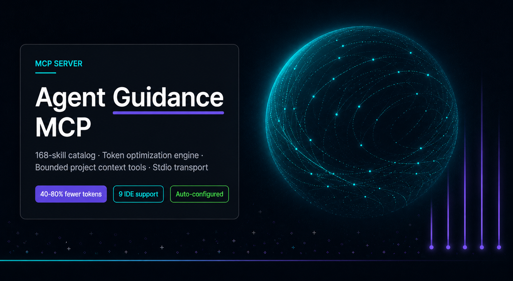
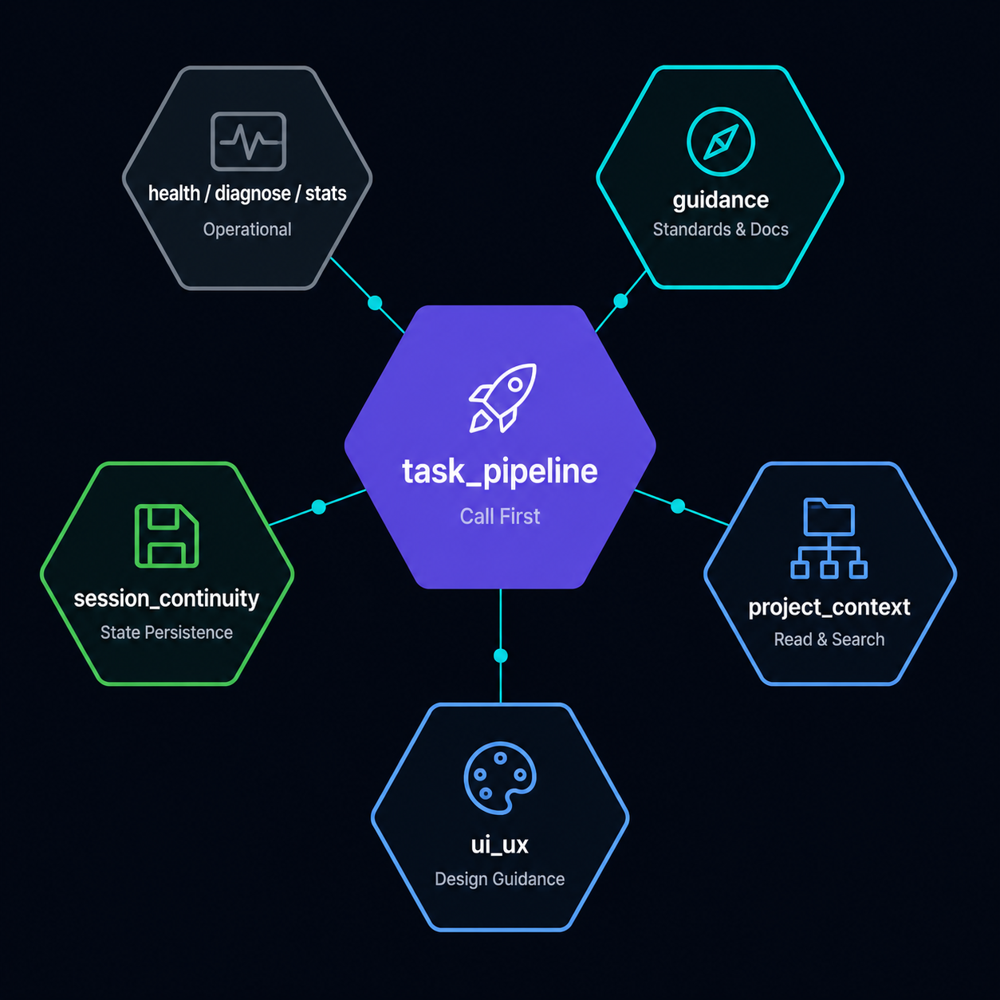
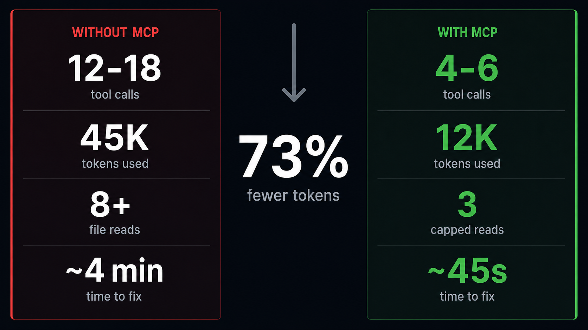
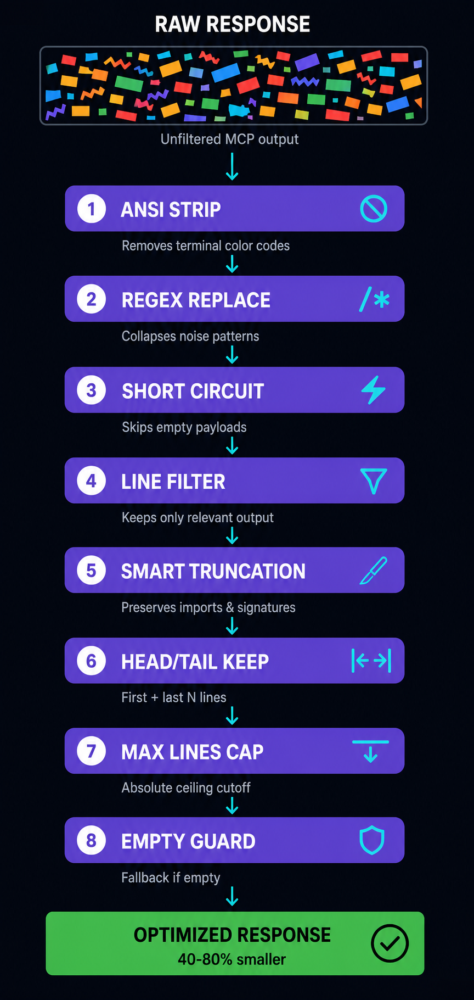

# Agent Guidance MCP


[](https://www.python.org/)
[](https://opensource.org/licenses/MIT)
[](https://modelcontextprotocol.io/)


[](https://ko-fi.com/JunMystery)



MCP server serving AI agent guidance through a **168-skill catalog**, bundled guidance corpus, workflow prompts, bounded project-code context tools, and a **token optimization engine** — all over **Stdio** transport.

Skills are sourced from [Everything Claude Code (ECC) v2.0.0](https://github.com/affaan-m/ECC) and community contributions, covering backend, frontend, testing, security, DevOps, data, research, and 12+ language ecosystems.

---

## Installation

Install the Agent Guidance MCP server and configure all local IDE clients with a single command:

**Linux / macOS (Bash):**
```bash
curl -fsSL https://raw.githubusercontent.com/JunMystery/Agent-Guidance-MCP/main/scripts/install.sh | bash
```

**Windows (CMD / PowerShell):**
```cmd
powershell -Command "irm https://raw.githubusercontent.com/JunMystery/Agent-Guidance-MCP/main/scripts/install.ps1 | iex"
```

*No prior Python installation required — the script bootstraps `uv` (a single-binary Python toolchain) automatically.*

### Verify Installation

Test locally with MCP Inspector:

```bash
DANGEROUSLY_OMIT_AUTH=true npx @modelcontextprotocol/inspector .venv/bin/python -m agent_guidance_mcp
```

Then call `task_pipeline(...)` to load guidance and bounded project context. See [Usage Guide](docs/usage.md) for workflows.

### Upgrading

**Server + IDE registrations:** rerun the install command above.

**Standards catalog & skills only:**
```bash
agent-guidance-mcp --update
```

**Executable package only:**
```bash
uv tool update agent-guidance-mcp
```

### Scheduled Auto-Update

```bash
agent-guidance-mcp --auto-update          # weekly (default)
agent-guidance-mcp --auto-update monthly  # monthly
```

Or via environment variable: `AGENT_AUTO_UPDATE_INTERVAL=weekly`

### Uninstalling

**Linux / macOS:**
```bash
curl -fsSL https://raw.githubusercontent.com/JunMystery/Agent-Guidance-MCP/main/scripts/uninstall.sh | bash
```

**Windows:**
```cmd
powershell -Command "irm https://raw.githubusercontent.com/JunMystery/Agent-Guidance-MCP/main/scripts/uninstall.ps1 | iex"
```

### Manual / Developer Install

```bash
python -m venv .venv
.venv/bin/pip install -e ".[dev]"      # Linux / macOS
.venv\Scripts\pip install -e ".[dev]"  # Windows
```

```bash
agent-guidance-mcp
.venv/bin/python -m agent_guidance_mcp          # Linux / macOS
.venv\Scripts\python.exe -m agent_guidance_mcp  # Windows
```

Custom corpus path:
```bash
AGENT_GUIDANCE_ROOT=/path/to/Agent-Guidance
```

Platform notes: [Installation](docs/installation.md) · [Client Setup](docs/setup/client-configuration.md)

---

## Supported IDEs

Works with any MCP-compatible client. Auto-configured by the installer:

| Claude Desktop / Claude Code | Cursor | VS Code (Copilot) |
| OpenCode / OMO | Gemini CLI | Windsurf |
| Cline / Roo-Code | Continue.dev | Antigravity |

---

## MCP Surface



### Tools

| Tool | Role | Key Operations |
|---|---|---|
| `task_pipeline` | **Call first** — one-stop context prep | Recommendations + tree + search + UI + execution sequence |
| `guidance` | Standards & skill catalog | `list`, `get`, `search`, `recommend`, `reason`, `docs` (Context7) |
| `project_context` | Bounded project file ops | `tree`, `search`, `read`, `symbols`, `references`, `structure`, `callers`, `callees`, `diff`, `snapshot` |
| `ui_ux` | Design guidance | `search`, `design_system`, `slides` |
| `session_continuity` | Task state persistence | `save`, `load`, `clear` |
| `health_check` / `diagnose` / `token_stats` | Operational | Server status, self-diagnostics, token savings |

### Resources

| URI | Description |
|---|---|
| `standards://manifest` | Indexed standards manifest (JSON) |
| `standards://skill/{name}` | On-demand skill capsule (Markdown) |
| `standards://document/{identifier}` | Standards document by slug (Markdown) |
| `standards://version` | Server version info (JSON) |

### Prompt

`workflow_prompt(mode, subject, target)` — Load workflow by mode: plan, test, deploy, debug, etc.

---

## Why Agent Guidance MCP

AI coding agents burn context fast. Every file read, every grep, every web search eats into the context window — and when it's gone, the agent forgets everything. Agent Guidance MCP solves this with three layers:

| Layer | What It Does | Your Gain |
|---|---|---|
| **Context Budgeting** | Caps file reads at 300 lines; smart-truncates source code preserving structure | Agent stays focused on relevant code, never drowns in noise |
| **Guidance Catalog** | 168 skills + coding standards + security rules served on-demand | Agent follows production patterns without you reminding it |
| **Token Optimization** | Strips comments, collapses whitespace, deduplicates output before it hits the LLM | **40–80% fewer tokens** per MCP response |

### What You Save

Measured on a typical 500-line React component refactor task:



```
                    Without MCP          With Agent Guidance MCP
                    ─────────────        ──────────────────────
Tool round-trips    12–18 calls          4–6 calls (task_pipeline consolidates)
Context used        ~45,000 tokens       ~12,000 tokens
File reads          8+ full reads        3 capped reads (300 lines ea.)
Standards lookup    Manual / guessed     Automatic via guidance()
Dead-ends           2–3 wrong searches   Zero (search-first discipline)
Time to first fix   ~4 minutes           ~45 seconds
```

### Token Optimization Pipeline

Every MCP response passes through an 8-stage filter before reaching your agent:



```
Raw Response
  │
  ├─ Stage 1  ANSI strip          ── removes terminal color codes
  ├─ Stage 2  Regex replace       ── collapses noise patterns
  ├─ Stage 3  Match/short-circuit ── skips empty payloads
  ├─ Stage 4  Line filter         ── keep only relevant output lines
  ├─ Stage 5  Smart truncation    ── preserves imports, signatures, constants
  ├─ Stage 6  Head/tail keep      ── first + last N lines with omission marker
  ├─ Stage 7  Max lines cap       ── absolute ceiling
  └─ Stage 8  Empty guard         ── fallback message if everything filtered
  │
  ▼
Optimized Response (40–80% smaller)
```

---

## How It Works In Practice

### Scenario: "Add JWT authentication to my Express API"

**Step 1 — Agent calls `task_pipeline` (ONE call)**

```
Agent: task_pipeline(task="Add JWT auth to Express API", focus="backend")
```

Returns in a single response:
- **Recommendations**: 8 relevant skills (api-design, security-review, backend-patterns, express-patterns...)
- **Project tree**: Directory structure of your Express project
- **Code search**: Pre-grepped results for "auth", "jwt", "token", "middleware"
- **Execution sequence**: Skills sorted in lifecycle order (spec → plan → build → test → review)

**Step 2 — Agent consults standards**

```
Agent: guidance(operation="search", query="JWT authentication middleware Express")
```

Returns: security-review skill, api-design patterns, OWASP auth cheatsheet — all pre-loaded, zero web search round-trips.

**Step 3 — Agent reads only what it needs**

```
Agent: project_context(operation="read", relative_path="src/middleware/auth.js")
```

Returns: 300 lines max. If the file is 800 lines, `smart_truncate` preserves imports, function signatures, and JSDoc — skipping implementation bodies.

**Step 4 — Agent implements with live docs**

```
Agent: guidance(operation="docs", query="jsonwebtoken sign options", identifier="node-jsonwebtoken")
```

Returns: current `jsonwebtoken` API docs from Context7 — no hallucinated API calls.

**Result**: Agent writes production-grade JWT middleware in ~3 tool calls instead of 15+, with automatic security review awareness.

---

## Environment Variables

| Variable | Purpose | Default |
|---|---|---|
| `AGENT_GUIDANCE_ROOT` | Custom standards corpus path | Bundled corpus |
| `AGENT_PROJECT_ROOT` | Override project root for context tools | `.` (cwd) |
| `AGENT_PROJECT_ALLOWED_ROOTS` | Whitelist directories for security | All user dirs |
| `AGENT_WATCHER_ENABLED` | Enable/disable CodeGraph file watcher | `true` |
| `AGENT_WATCHER_INTERVAL` | Watcher poll interval (seconds) | `30` |
| `AGENT_WATCHER_DEBOUNCE_MULTIPLIER` | Debounce multiplier after changes | `2.0` |
| `AGENT_WATCHER_REF_THRESHOLD` | Batch size before full reference resolve | `50` |
| `AGENT_AUTO_UPDATE_INTERVAL` | Auto-update schedule | `weekly` |

---

## Documentation

- [Getting Started](docs/getting-started.md) — first-time walkthrough.
- [Installation](docs/installation.md) — automatic and manual setup.
- [Usage Guide](docs/usage.md) — recommended agent workflows and examples.
- [Client Setup](docs/setup/client-configuration.md) — VS Code, Copilot, Cursor, Gemini, OpenCode, Windsurf, Antigravity.
- [MCP Surface](docs/reference/mcp-surface.md) — all tools, prompts, and resources.
- [Project Context Tools](docs/reference/project-context-tools.md) — tree, search, read, snapshot, symbols, references.
- [Skills Overview](docs/skills/SKILLS_OVERVIEW.md) — full catalog of 185+ skills.
- [Integrated Repositories](docs/integrations/integrated-repositories.md) — third-party repos in the codebase.
- [Potential Integrations](docs/integrations/potential-integrations.md) — candidates for future inclusion.
- [Development Guide](docs/development.md) — tests, project structure, maintainer notes.
- [MCP Integrations Guide](agent-guidance/mcp-integrations/README.md) — SQLite caching, CodeGraph, Context7 docs.

---

## Development

```bash
python -m pytest
```

The test suite verifies catalog discovery, MCP handler registration, standards search, recommendation behavior, and project-context tooling. See [Development Guide](docs/development.md) for more detail.
