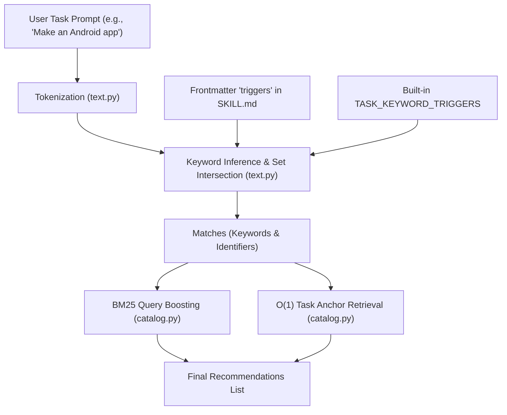

# Auto Skill Discovery Pipeline

This document describes the three-tier pipeline used by the Agent Guidance MCP server to automatically detect, classify, and match skills/guidelines for user tasks.

---

## 🏗️ Architecture Workflow

The following flowchart illustrates how a raw user task prompt is processed to identify and prioritize matching skills:



---

## ⚙️ Processing Phases

### 1. Tokenization & Normalization
* **File**: `src/agent_guidance_mcp/text.py`
* **Action**: Extracts tokens from the task string, filters out single-character words, and converts all strings to lowercase.

### 2. Flexible Keyword Inference & Root Mapping
* **File**: `src/agent_guidance_mcp/text.py` (`infer_task_keywords`)
* **Action**: Compares extracted task terms against the trigger dictionary. To handle grammatical variations and compound terms, the matching engine applies three fallback mechanisms:
  * **Exact Match**: Returns triggers that are exactly matched in task terms.
  * **Prefix Matching**: Matches variants like `testing` -> `test` or `authentication` -> `auth` by checking if either string starts with the other.
  * **Common Root Matching**: Matches words with length $\ge 6$ sharing the same 6-character prefix (e.g., `accessible` maps to `accessibility`).
  * **Suffix/Plural Removal**: Strips common plural and gerund endings (`-s`, `-es`, `-ing`, `-ed`) to match keywords like `databases` to `database`.

### 3. Catalog Matching & Priority Routing
* **File**: `src/agent_guidance_mcp/catalog.py` (`recommend_context`)
* **Action**: Matches the inferred keywords to pull relevant documentation:
  * **O(1) Anchor Promotion**: If an inferred keyword matches a declared `anchor` in any skill frontmatter, that skill file path is immediately loaded into recommendations.
  * **BM25 Search Weight Boosting**: Matched keywords are appended twice to the semantic query to bias search rankings towards documents in the relevant domains (e.g., `security`, `frontend`, `api`).

### 4. Semantic Search & Hybrid Similarity Ranking
* **File**: `src/agent_guidance_mcp/catalog.py` (`search_entries`) & `src/agent_guidance_mcp/embeddings.py`
* **Action**: Generates a query vector embedding and uses cosine similarity to score skills:
  * **Pre-computed Embeddings**: Bundled global skills are loaded instantly from a pre-computed `skills_embeddings.json` index.
  * **Dynamic Workspace Skill Embedding**: Local skills located in `.agents/skills/`, `.opencode/skills/`, or `.claude/skills/` are dynamically loaded and embedded on startup using the local model.
  * **Hybrid Rank Blending**: Final ranking combines the term-frequency keyword score and the vector cosine similarity score (scaled to 0-50 and added to the keyword score).
  * **Graceful Fallback**: If the `sentence-transformers` library is not installed, the search engine gracefully falls back to pure keyword-based search.

---

## 📋 Extending Triggers in Skill Files

To register any new or existing skill in the Auto Skill Discovery pipeline, simply add frontmatter tags to the skill's `SKILL.md` file:

```yaml
---
name: my-custom-skill
description: Guidelines for custom operations
triggers: [custom, operations, modularize, modular]
anchors: [custom-anchor]
dependencies: [base-standard-identifier]
---
```
* Adding words to `triggers` will automatically feed them to the matching engine.
* Declaring `anchors` will map those keywords to this file as top-priority recommendations.
